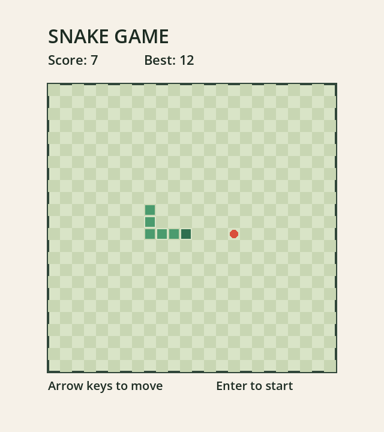

# Snake Game

Godot 4와 GDScript로 만든 간단한 뱀 게임입니다.  
작게 시작해서 바로 실행하고, 입력 처리와 충돌 처리 같은 기본기를 연습하기 좋게 구성했습니다.

## 게임 화면



## 실행 방법

### 가장 빠른 방법

`run-game.bat`를 더블클릭하면 바로 게임이 실행됩니다.

### 터미널에서 실행

```bat
C:\yelingg\snake-game\run-game.bat
```

### Godot 에디터에서 열기

1. Godot 4를 실행합니다.
2. `C:\yelingg\snake-game` 폴더를 Import 합니다.
3. `Run Project`를 누릅니다.

## 조작 방법

- 방향키: 이동
- Enter: 게임 시작 / 재시작

## 포함된 기능

- 시작 화면
- 뱀 이동
- 먹이 생성
- 점수 증가
- 최고 점수 표시
- 점수에 따른 속도 증가
- 벽 충돌 처리
- 자기 몸 충돌 처리
- 게임 오버 후 재시작

## 프로젝트 구조

- `project.godot`: Godot 프로젝트 설정
- `scenes/main.tscn`: 메인 씬
- `scripts/main.gd`: 게임 로직
- `run-game.bat`: Windows 실행 파일
- `screenshots/gameplay.png`: README용 게임 화면 캡처

## 메모

Godot이 기본 경로가 아닌 다른 위치에 설치되어 있다면 `run-game.bat` 안의 실행 파일 경로를 설치 위치에 맞게 바꾸면 됩니다.
